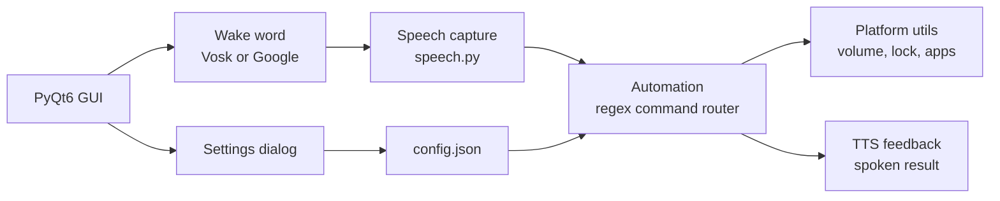

<div align="center">


<a href="https://github.com/abijithmr/PROJECT-CERP-y">
  
</a>

<br/>


</div>

Open an app, change the volume, take a screenshot, or dictate a whole document without touching a mouse or keyboard.

> [!NOTE]
> Volume, brightness and process tracking need **Windows**. Opening apps, screenshots, lock, sleep and shutdown also have best-effort macOS and Linux fallbacks.

---

## Contents

- [What it does](#what-it-does)
- [Voice command cheat sheet](#voice-command-cheat-sheet)
- [How it fits together](#how-it-fits-together)
- [Accessibility](#accessibility)
- [Getting started](#getting-started)
- [Configuration](#configuration)
- [Testing](#testing)
- [Project layout](#project-layout)
- [Known limitations](#known-limitations)
- [Roadmap](#roadmap)
- [Contributors](#contributors)
- [License](#license)

---

## What it does

| Area | Highlights |
|:-----|:-----------|
| **Apps** | Open and close Notepad, Calculator, Chrome, Word, Excel, PowerPoint, plus web apps like Gmail, YouTube, Instagram and Google |
| **System** | Volume and brightness (relative or exact), scrolling, screenshots, lock, sleep, and a two-step shutdown |
| **Dictation** | Continuous voice typing into Notepad with spoken punctuation |
| **Status** | Battery, time, internet, CPU and memory on request |
| **Custom commands** | Map any phrase to a local file or URL from the Settings dialog |
| **Repeat** | Say "repeat" to run the last successful command again |
| **History** | View, clear or export your command history to a `.txt` file |

Commands are matched with ordered regular expressions, so phrasing is flexible ("increase", "raise" and "turn up" all work) instead of relying on exact prefixes.

---

## Voice command cheat sheet

<details open>
<summary><b>System controls</b></summary>

| Say | Result |
|:----|:-------|
| "set volume to 40" | Sets volume to 40% |
| "increase volume" / "turn down volume" | Nudges volume up or down |
| "set brightness to 70" | Sets brightness to 70% |
| "increase brightness" / "lower brightness" | Nudges brightness up or down |
| "scroll up" / "scroll down" | Scrolls the active window |
| "take a screenshot" | Captures the screen |
| "lock the screen" | Locks the computer |
| "sleep" | Puts the computer to sleep |
| "shutdown", then "confirm shutdown" or "cancel shutdown" | Shuts down only after you confirm |
| "system status" | Reads out battery, time, internet, CPU and memory |

</details>

<details open>
<summary><b>Apps and media</b></summary>

| Say | Result |
|:----|:-------|
| "open notepad" | Launches the app |
| "open youtube" | Opens the site in your browser |
| "close chrome" | Closes the app |
| "skip shorts" / "skip next" | Skips to the next short or item |
| "exit" / "quit application" | Closes CERP-y |

</details>

<details>
<summary><b>Voice typing</b></summary>

Say **"start voice typing"** and speak normally. Say **"stop voice typing"** to finish.

Spoken punctuation is converted as you go: "comma", "period", "question mark", "new line", "new paragraph" and more.

</details>

<details>
<summary><b>Meta commands</b></summary>

| Say | Result |
|:----|:-------|
| "repeat" / "repeat that" | Runs the last successful command again |
| Any phrase you added in Settings | Opens the file or URL you mapped to it |

</details>

---

## How it fits together



1. The **wake word** listener waits for "hey cerp". It runs offline with Vosk when a model is available and falls back to online Google recognition otherwise.
2. **Speech capture** turns what you say into text.
3. **Automation** matches the text against its command patterns and runs the right handler.
4. **Platform utils** does the actual system work on Windows, macOS or Linux.
5. **TTS feedback** reads the result back to you without blocking the app.

---

## Accessibility

CERP-y is built around people who cannot rely on a mouse or keyboard, and it still works for those who can.

- **Spoken confirmation** of every command result (can be turned off)
- **High-contrast mode** and **large-text mode**
- **Adjustable listening timeout** and **microphone sensitivity**
- **Live Settings dialog**, so nothing requires editing files
- **Full keyboard navigation**: button mnemonics, a sensible tab order and global shortcuts

| Shortcut | Action |
|:---------|:-------|
| `Ctrl` + `Space` | Start voice control |
| `Ctrl` + `,` | Open Settings |
| `Ctrl` + `Q` | Quit |

---

## Getting started

**Requirements**

- Python 3.12 or newer
- A working microphone
- *(Optional)* a [Vosk model](https://alphacephei.com/vosk/models) such as `vosk-model-small-en-us-0.15` for offline wake-word detection

**Install and run**

```sh
git clone https://github.com/abijithmr/PROJECT-CERP-y.git
cd PROJECT-CERP-y
pip install -r requirements.txt
python gui.py
```

**Turn on offline wake word (optional)**

1. Download and unzip a Vosk model.
2. Set `vosk_model_path` in `config.json` to the model folder.

Without a model, CERP-y still works and uses online recognition for the wake word.

---

## Configuration

Everything lives in `config.json`, which is created with defaults on first run. You can also change all of it from the in-app **Settings** dialog.

| Key | Purpose | Default |
|:----|:--------|:--------|
| `wake_word` | Phrase that starts listening | `"hey cerp"` |
| `listen_timeout` | Seconds to wait for speech | `5` |
| `phrase_time_limit` | Max seconds per phrase | `5` |
| `energy_threshold` | Microphone sensitivity | `300` |
| `vosk_model_path` | Folder of the offline model | `"model"` |
| `ui.high_contrast` | High-contrast theme | `false` |
| `ui.large_text` | Larger interface text | `false` |
| `ui.tts_feedback` | Spoken confirmations | `true` |
| `app_paths` | App name to executable path | Notepad, Calculator, Chrome, Office |
| `web_apps` | Name to URL | Gmail, YouTube, Instagram, Google |
| `custom_commands` | Your own phrase to path or URL | `{}` |

> [!TIP]
> A missing or corrupt `config.json` is not a problem. CERP-y falls back to built-in defaults instead of failing to start.

---

## Testing

```sh
python -m unittest discover -s tests -v
```

The suite covers command parsing, volume and brightness commands, dictation punctuation and configuration loading.

---

## Project layout

```text
PROJECT-CERP-y/
├── gui.py               PyQt6 main window and shortcuts
├── settings_dialog.py   In-app settings and accessibility options
├── automation.py        Command patterns and handlers
├── speech.py            Microphone capture, passes text to Automation
├── wake_word.py         Offline (Vosk) or online wake-word listener
├── tts_feedback.py      Non-blocking spoken feedback
├── platform_utils.py    Windows / macOS / Linux system helpers
├── config_manager.py    Load, validate and save config.json
├── config.json          User-editable settings
├── tests/               Unit tests
├── logs/                Runtime logs (git-ignored)
├── CHANGELOG.md
└── requirements.txt
```

---

## Known limitations

- Volume and brightness control require Windows (`pycaw`, `WMI`); other systems depend on tools such as `amixer`, `brightnessctl` and `loginctl` being installed.
- Voice typing targets Notepad.
- `PyAudio` can be tricky to install on some systems. If `pip` fails, install your platform's PortAudio package first.

See [`CHANGELOG.md`](CHANGELOG.md) for what has changed so far.

---

## Roadmap

- [ ] Auto-start on boot
- [ ] Gesture recognition and eye-tracking support
- [ ] Multiple named command profiles

---

## Contributors

| | |
|:--|:--|
| [**abijithmr**](https://github.com/abijithmr) | Project owner |
| [**alan kj**](https://github.com/ala527) | Contributor |
| [**AlwinJCOde667**](https://github.com/AlwinJCOde667) | Contributor |

Questions or ideas? Open a [GitHub issue](https://github.com/abijithmr/PROJECT-CERP-y/issues).

---

## License

Released under the [MIT License](LICENSE).

> [!IMPORTANT]
> This project is not affiliated with any other "CERP" projects.

<div align="center">


</div>
